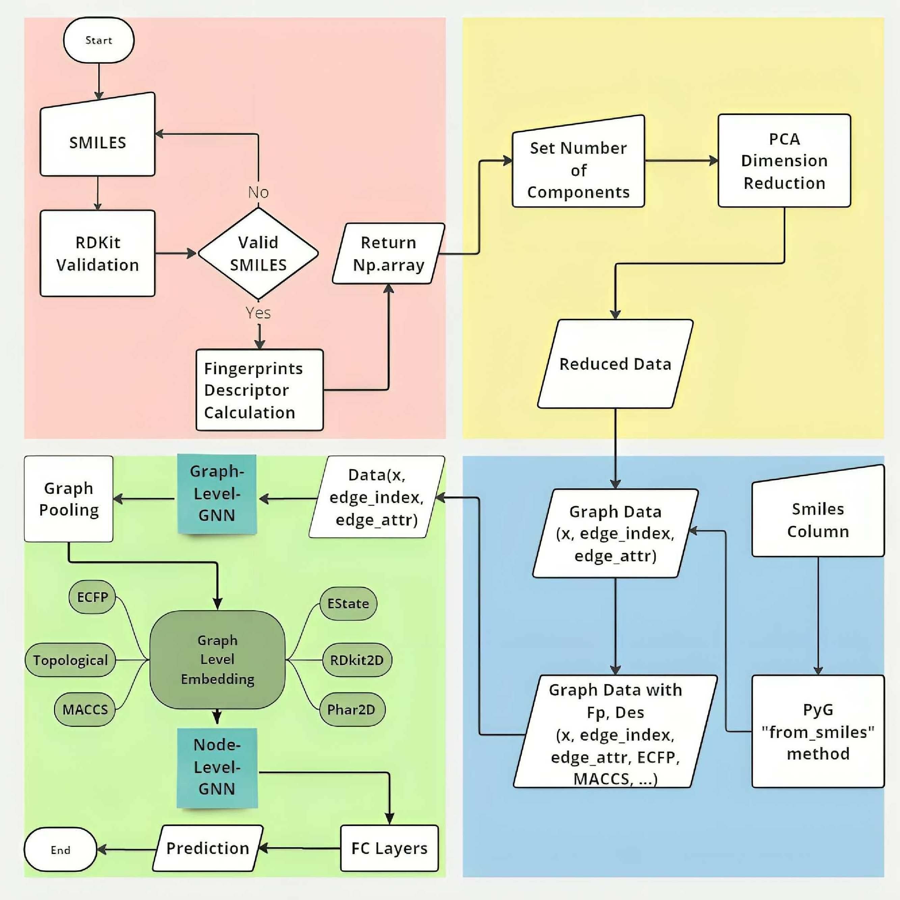

# FDGNN (Fingerprints and Descriptors with Graph Neural Networks)


<p align="center">
  
</p>

## Project Description
FDGNN is a research-focused project for Molecular Property Prediction using Graph Neural Networks (GNNs). It integrates molecular fingerprints and descriptors with GNNs for comprehensive molecular data modeling. The project includes data preprocessing, feature extraction, model training, evaluation, and visualization.

## Table of Contents
- [Project Description](#project-description)
- [Folders Structure](#folders-structure)
- [Installation](#installation)
- [Usage](#usage)
- [Modules](#modules)
- [Notebooks](#notebooks)
- [Contributing](#contributing)
- [License](#license)

## Folders Structure
```
Thesis/
│
├── data/
│   ├── ...
│   ├── README.md
│   └── datasets/
│       ├── bace.csv
│       ├── BBBP.csv
│       ├── clintox.csv
│       ├── Esol.csv
│       ├── freesolv.csv
│       ├── HIV.csv
│       ├── Lipophilicity.csv
│       └── ...
│   # Contains data used for models
│
├── examples/
│    └── ...
│   # Contains various examples of model training in different scenarios (different datasets, Random split, scaffold split, Cross-validation, etc.)
│
├── models/
│    └── GnnPooling.py
│   # Proposed model code and structure
│
├── modules/
│   ├── __init__.py
│   ├── data_handler.py
│   ├── fingerprints_descriptors.py
│   ├── utils_classification.py
│   ├── utils_cls_cv.py
│   ├── utils_reg_cv.py
│   └── utils_regression.py
│   # Various functions and classes for data preparation, dataset construction in PyG, model training, and evaluation
│
├── notebooks/
│   └── ...
│   # Notebooks for testing modules
│
├── test_results/
│   ├── Bace.ipynb
│   ├── Bace2.ipynb
│   ├── BBBP.ipynb
│   ├── Esol.ipynb
│   ├── Freesolv.ipynb
│   └── Lipo.ipynb
│   # **Contains final model results on datasets**
│
├── .gitignore
├── README.md
└── requirements.txt
```

## Installation
To set up the project locally, follow these steps:

### Prerequisites
Ensure you have Python installed (recommended: Python 3.8+). Then install the required dependencies:

```bash
pip install pyg_lib torch_scatter torch_sparse torch_cluster torch_spline_conv -f https://data.pyg.org/whl/torch-2.3.0+cu121.html
pip install torch_geometric
pip install deepchem
pip install rdkit
pip install -q ogb
pip install dgllife
pip install torchinfo
pip install molfeat
```

## Usage
### Running a Notebook
To explore datasets and train models interactively, navigate to the `notebooks/` directory and run:
```bash
jupyter notebook notebooks/data_handler.ipynb
```

## Modules
The `modules/` directory contains the core functionalities:
- `data_handler.py`: Functions and classes for data preprocessing.
- `fingerprints_descriptors.py`: Molecular fingerprint and descriptor calculations.
- `utils_classification.py`: Utility functions for classification tasks.
- `utils_regression.py`: Utility functions for regression tasks.
- `utils_cls_cv.py` & `utils_reg_cv.py`: Cross-validation utilities for classification and regression.


## Contributing
We welcome contributions! To contribute:
1. Fork the repository.
2. Create a new branch (`git checkout -b feature-branch`).
3. Commit your changes (`git commit -m 'Add new feature'`).
4. Push to your branch (`git push origin feature-branch`).
5. Open a Pull Request.

## License
This project is licensed under the MIT License. See `LICENSE` for details.

